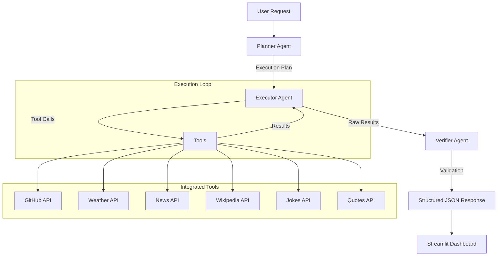

# AI Operations Assistant


## Demo Images


## Project Overview

The AI Operations Assistant is an enterprise-grade, multi-agent system designed to autonomously plan, execute, and verify complex operational tasks. Built on a microservices architecture, it leverages Large Language Models (LLMs) to orchestrate a suite of integrated tools, providing real-time intelligence and automation.

This system demonstrates advanced agentic workflows, separating reasoning (Planner), action (Executor), and validation (Verifier) into distinct, connected components.

## Architecture



## Key Features

1.  **Multi-Agent Orchestration**: Implements a chain-of-thought workflow where agents specialize in planning, execution, and verification.
2.  **Tool Integration**: Seamlessly connects to 6 external APIs including GitHub, Open-Meteo, NewsAPI, and Wikipedia.
3.  **Dual LLM Support**: Configurable to run on Google Gemini (default) or Groq (Llama 3) for high-performance inference.
4.  **Resilient Architecture**: Includes automatic backend recovery, health monitoring, and graceful error handling.
5.  **Caching Layer**: Redis-based caching strategy to optimize API usage and reduce latency.
6.  **Premium User Interface**: A data-centric dashboard built with Streamlit, featuring real-time workflow visualization and cost analytics.

## Installation & Setup

Follow these steps to set up the project locally.

### 1. Prerequisites
*   Python 3.10 or higher
*   Git

### 2. Clone the Repository
```bash
git clone https://github.com/praaatap/Ai-Operations-Assistant.git
cd Ai-Operations-Assistant
```

### 3. Create a Virtual Environment (Recommended)
It is highly recommended to use a virtual environment to manage dependencies.

**Windows:**
```powershell
# Create the virtual environment
python -m venv venv

# Activate the virtual environment
.\venv\Scripts\activate
```

**macOS / Linux:**
```bash
# Create the virtual environment
python3 -m venv venv

# Activate the virtual environment
source venv/bin/activate
```

*Note: When activated, your terminal prompt should show `(venv)`.*

### 4. Install Dependencies
```bash
pip install -r requirements.txt
```

### 5. Configuration
Copy the example environment file and configure your API keys.

```bash
cp .env.example .env
# On Windows use: copy .env.example .env
```

Open `.env` in a text editor and add your API keys:
*   `GEMINI_API_KEY`: Required for Gemini LLM.
*   `GROQ_API_KEY`: Required if using Groq.
*   `NEWS_API_KEY`: Required for News tool.

## Usage

### 🚀 Quick Start (Recommended)

To launch the full system (Backend + Frontend) in a single command:

```bash
# Ensure your venv is activated
streamlit run streamlit_app.py
```

The application will automatically start the backend server in the background and open the web interface in your browser at `http://localhost:8501`.

### 🛠️ Manual Development Mode

If you prefer to run services separately for debugging:

**Terminal 1 (Backend API):**
```bash
uvicorn main:app --reload --host 127.0.0.1 --port 8000
```

**Terminal 2 (Frontend Dashboard):**
```bash
streamlit run streamlit_app.py
```

## Docker Support

The application is fully containerized and available on the GitHub Container Registry (GHCR).

### Pull & Run
```bash
# Pull the latest image
docker pull ghcr.io/praaatap/ai-operations-assistant:latest

# Run the container (detached mode)
docker run -d -p 8501:8501 --env-file .env ghcr.io/praaatap/ai-operations-assistant:latest
```

*Note: You must provide a `.env` file with your API keys.*

## API Endpoints

The system exposes a RESTful API for direct integration. You can explore the interactive API documentation (Swagger UI) at `http://localhost:8000/docs` when the server is running.

*   `POST /process`: Submit a natural language task.
*   `GET /health`: Check system status and agent availability.
*   `GET /docs`: Interactive API documentation (Swagger UI).
*   `GET /redoc`: Alternative API documentation (ReDoc).

## Technology Stack

*   **Backend**: FastAPI, Uvicorn
*   **Frontend**: Streamlit
*   **AI Orchestration**: LangChain, LangGraph
*   **LLM Providers**: Google GenAI (Gemini), Groq
*   **Caching**: Redis (with in-memory fallback)
*   **Deployment**: Docker-ready, Streamlit Cloud compatible

## Contact

For inquiries regarding this project, please open an issue in the repository.
